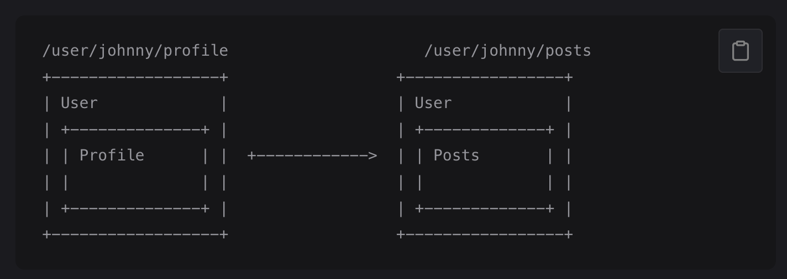

# 04 Nested Routes



## Nested Routes

```html
<div id="app">
  <router-view></router-view>
</div>
```

```html
const User = {
  template: `
    <div class="user">
      <h2>User {{ $route.params.id }}</h2>
      <router-view></router-view> // <- nested router view
    </div>
  `,
}
```

```javascript
const routes = [
  {
    path: '/user/:id',
    component: User,
    children: [
      { 
        // 當 /user/:id 匹配成功
        // UserHome 將會被渲染在 User 的 <router-view> 中
        path: '', 
        name: 'user',
        component: UserHome 
      },
      {
        // 當 /user/:id/profile 配對成功
        // UserProfile 將會渲染到 User 的 <router-view> 内部
        path: 'profile',
        name: 'profile',
        component: UserProfile,
      },
      {
        // 當 /user/:id/posts 當配對成功
        // UserPosts 將會渲染到 User 的 <router-view> 内部
        path: 'posts',
        name: 'posts',
        component: UserPosts,
      },
    ],
  },
]
```

> 可以對嵌套路由使用 `name` 屬性，這樣就可以在 `<router-link>` 中使用它們。

```html
<router-link :to="{ name: 'user', params: { id: 123 }}">User</router-link>
<router-link :to="{ name: 'profile', params: { id: 123 }}">Profile</router-link>
<router-link :to="{ name: 'posts', params: { id: 123 }}">Posts</router-link>
```
