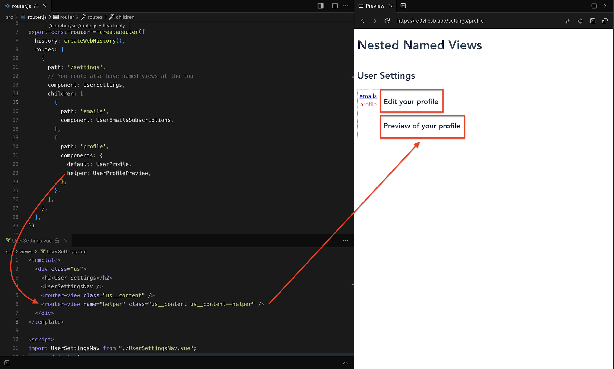

# 07 Named Views

可以設定一個畫面有多個 router-view，這樣可以讓不同的 component 在同一個畫面中顯示。

```html
/settings/emails                                       /settings/profile
+-----------------------------------+                  +------------------------------+
| UserSettings                      |                  | UserSettings                 |
| +-----+-------------------------+ |                  | +-----+--------------------+ |
| | Nav | UserEmailsSubscriptions | |  +------------>  | | Nav | UserProfile        | |
| |     +-------------------------+ |                  | |     +--------------------+ |
| |     |                         | |                  | |     | UserProfilePreview | |
| +-----+-------------------------+ |                  | +-----+--------------------+ |
+-----------------------------------+                  +------------------------------+
```



> default router-view 的名稱是 `default` 或是沒有名稱的 router-view。
> router-view 有設定 name 屬性，就會顯示對應的 component。
