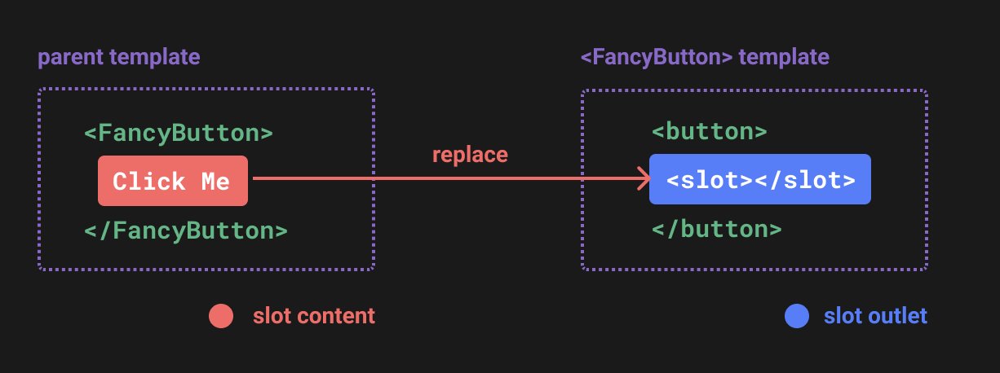
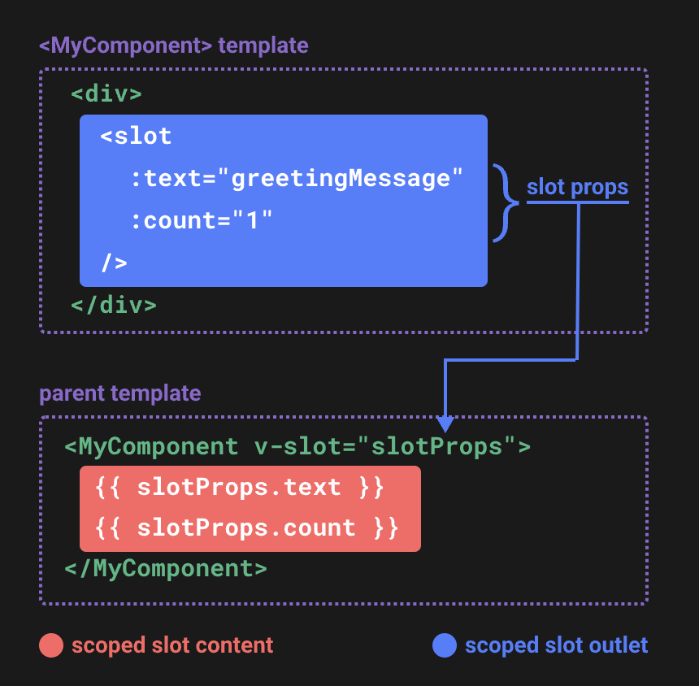

# Slots

## 基本使用

```html
<!-- Parent -->
<FancyButton>
  Click me! <!-- 插槽內容 -->
</FancyButton>
```

```html
<!-- FancyButton -->
<button>
  <slot></slot> <!-- 插槽 -->
</button>
```

```html
<!-- Rendered -->
<button>Click me!</button>
```



## 作用區域

```html
<!-- Parent -->
<span>{{ message }}</span>
<FancyButton>{{ message }}</FancyButton>
```

```html
<!-- FancyButton -->
<button>
  <slot></slot>
</button>
```

```html
<!-- Rendered -->
<span>Hello world</span>
<button>Hello world</button>
```

> 插槽內容會被渲染在父元素的作用區域中。

## 默認 slot 內容

```html
<!-- Parent -->
<FancyButton></FancyButton>
```

```html
<!-- FancyButton -->
<button>
  <slot>Submit</slot>
</button>
```

```html
<!-- Rendered -->
<button>Submit</button>
```

## 具名 slot

```html
<!-- BaseLayout.vue -->
<template>
  <div class="container">
    <header>
      <slot name="header"></slot>
    </header>
    <main>
      <slot></slot>
    </main>
    <footer>
      <slot name="footer"></slot>
    </footer>
  </div>
</template>

<style>
  footer {
    border-top: 1px solid #ccc;
    color: #666;
    font-size: 0.8em;
  }
</style>
```

```html
<!-- Parent -->
<script setup>
import BaseLayout from './BaseLayout.vue'
</script>

<template>
  <BaseLayout>
    <template #header>
      <h1>Here might be a page title</h1>
    </template>

    <!-- <template #default> -->
      <p>A paragraph for the main content.</p>
      <p>And another one.</p>
    <!-- </template> -->

    <template #footer>
      <p>Here's some contact info</p>
    </template>
  </BaseLayout>
</template>
```

> 沒指定名稱的插槽內容會被渲染在沒有名稱的插槽中，或是使用 `default` 作為名稱。

## 動態 slot 名稱

```html
<base-layout>
  <template v-slot:[dynamicSlotName]>
    ...
  </template>

  <!-- 縮寫為 -->
  <template #[dynamicSlotName]>
    ...
  </template>
</base-layout>
```

## 將子元件的資料傳遞到插槽

```html
<!-- <MyComponent> 的模板 -->
<div>
  <slot :text="greetingMessage" :count="1"></slot>
</div>
```

```html
<!-- Parent -->
<MyComponent v-slot="{ text, count }">
  <p>{{ text }}</p>
  <p>Count is {{ count }}</p>
</MyComponent>
```



> 透過 `v-slot` 可以將子元件的資料傳遞到插槽中。

## Renderless Components

```html
<MouseTracker v-slot="{ x, y }">
  Mouse is at: {{ x }}, {{ y }}
</MouseTracker>
```

> Renderless Components 是一個沒有任何 UI 的元件，只是將邏輯和資料傳遞到插槽中。
> 透過 Renderless Components 可以將邏輯和 UI 分離。

