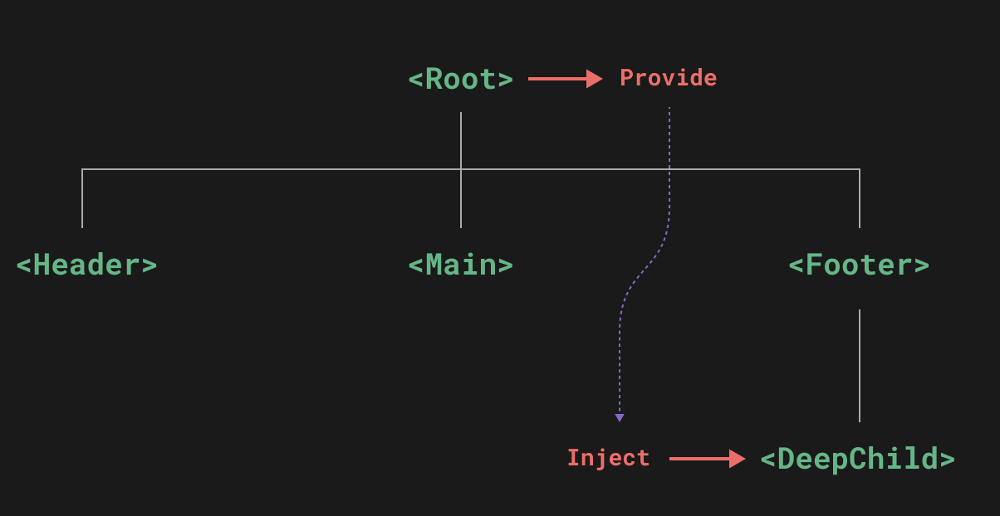

# 07 Provide Inject



## Provide

```vue
<script setup>
import { provide } from 'vue'

provide(/* key */ 'message', /* value */ 'hello!')

</script>
```

## App-level Provide

```javascript
import { createApp } from 'vue'

const app = createApp({})

app.provide(/* key */ 'message', /* value */ 'hello!')
```

## Inject

```vue
<script setup>
import { inject } from 'vue'
const message = inject('message')

// 如果沒有找到對應的 provide，可以提供默認值
const value = inject('message', '這是默認值')
</script>
```

> 會從最近的 provide 開始尋找，找到就停止。
> 如果沒有找到對應的 provide，可以提供默認值。
> 需要注意命名衝突，可能找錯了 provide。

## 搭配 Reactivity

```vue
<!-- inside provider component -->
<script setup>
import { provide, ref } from 'vue'

const location = ref('North Pole')

function updateLocation() {
  location.value = 'South Pole'
}

provide('location', {
  location,
  updateLocation
})
</script>
```

```vue
<!-- in injector component -->
<script setup>
import { inject } from 'vue'

const { location, updateLocation } = inject('location')
</script>

<template>
  <button @click="updateLocation">{{ location }}</button>
</template>
```

> 不要直接修改 provide 的值，而是透過方法修改。

## 使用 readonly 保護 provide 的值

```vue
<script setup>
import { ref, provide, readonly } from 'vue'

const count = ref(0)
provide('read-only-count', readonly(count))
</script>
```

## 使用 Symbol 作為 key

```vue
// keys.js
export const myInjectionKey = Symbol()
```

```vue
// 在供給方組件中
import { provide } from 'vue'
import { myInjectionKey } from './keys.js'

provide(myInjectionKey, { /*
  要提供的數據
*/ });
```

```vue
// 注入方組件
import { inject } from 'vue'
import { myInjectionKey } from './keys.js'

const injected = inject(myInjectionKey)
```

> 使用 Symbol 作為 key，可以避免命名衝突。